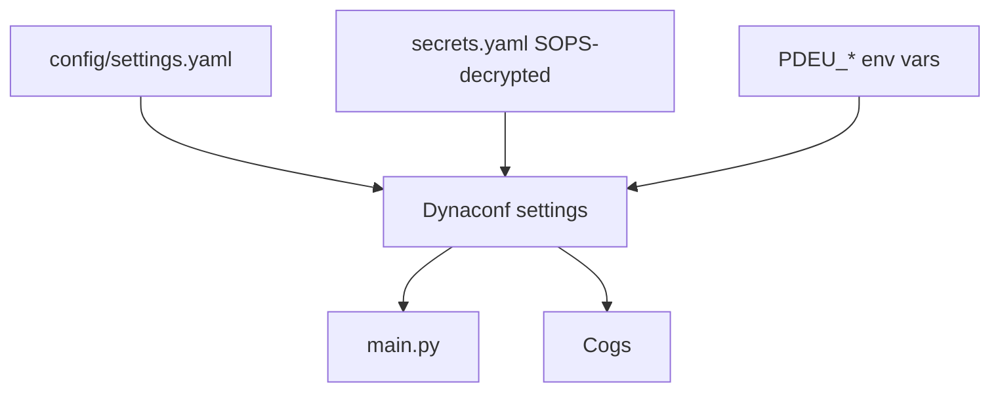
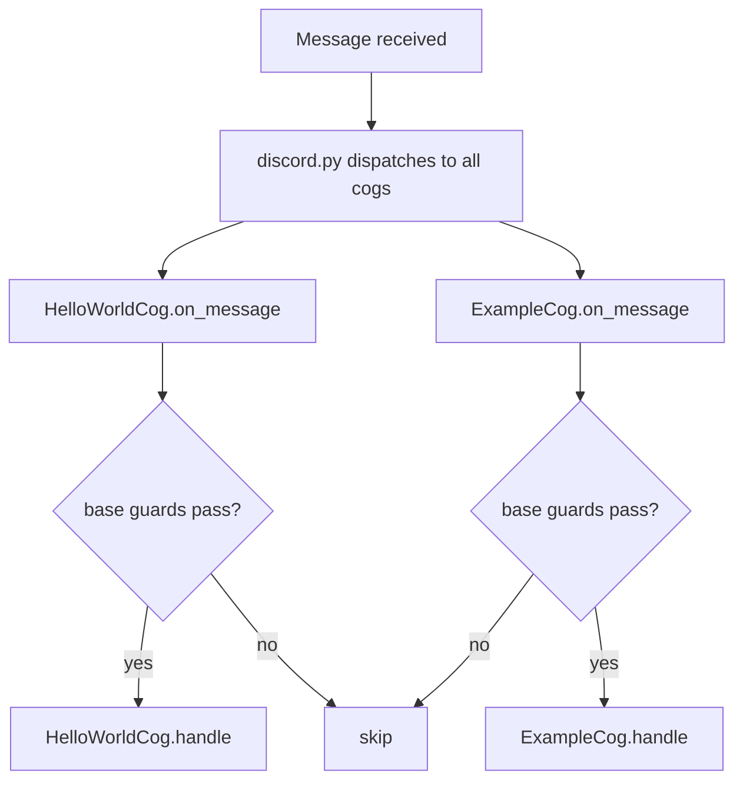

# pdeu-discord-bot

A Discord bot that watches a specific channel and replies `hello world` whenever it sees the word `Nice` (as a standalone word, surrounded by whitespace).

## Features

- Watches a single configurable channel.
- Replies `hello world` when any configured trigger phrase appears as a standalone word.
- Ignores all bot messages (including its own) to prevent feedback loops.
- Modular **cog-based architecture**: each feature is a self-contained file under `cogs/`. Add a new feature by dropping in a new cog — no edits to existing code.
- **Dynaconf + SOPS + age** configuration: non-secret config is version-controlled in YAML, secrets are encrypted at rest with [age](https://github.com/FiloSottile/age) via [SOPS](https://github.com/getsops/sops).

## Architecture

The bot uses `discord.py`'s `commands.Bot` and the **cog** pattern. Each feature is a class that extends `MessageWatcherCog`, which centralizes the shared guards (ignore bots, channel filter). Feature cogs only implement `handle(message)`.

```
pdeu-discord-bot/
├── .sops.yaml            # SOPS config: which age recipient(s) to encrypt for
├── .gitignore
├── .python-version
├── README.md
├── log_setup.py          # Two-phase logging config (stdout; DEBUG via PDEU_LOG_LEVEL)
├── main.py               # Entry point: creates Bot, loads cogs, runs
├── pyproject.toml        # Project metadata and dependencies
├── config/
│   ├── __init__.py       # Re-exports the singleton `settings`
│   ├── settings.py       # Dynaconf instance: sources, loaders, env selection
│   ├── settings.yaml     # Non-secret, version-controlled config (per-env)
│   └── sops_loader.py    # Custom dynaconf loader: decrypts secrets.yaml
├── age/
│   └── README.txt        # Where age/keys.txt lives (gitignored)
├── secrets.example.yaml  # Plaintext template for the encrypted secrets file
├── secrets.yaml          # SOPS-encrypted secrets (created during setup)
└── cogs/
    ├── __init__.py
    ├── base.py           # MessageWatcherCog — shared guards (bots, channel)
    ├── hello_world.py    # "Nice" → "hello world"
    └── example.py        # Template for new feature cogs
```

### Configuration loading order

Sources are merged in increasing precedence — later wins:

1. `config/settings.yaml` — non-secret defaults, per-environment sections.
2. `secrets.yaml` — SOPS+age encrypted secrets, decrypted at load time by `config/sops_loader.py`.
3. `PDEU_*` environment variables — for local overrides / CI / deploys where re-encrypting isn't worth it.

The active environment is selected with `ENV_FOR_DYNACONF` (default `development`); the matching `[<env>]` section in `config/settings.yaml` is applied on top of `[default]`.



### Message dispatch flow



Each cog independently decides whether to act, so multiple features can react to the same message, or just one. The shared guards run per-cog from `MessageWatcherCog`, so there's no duplication.

## Prerequisites

- Python 3.14+
- [uv](https://github.com/astral-sh/uv) (or any modern Python toolchain)
- [age](https://github.com/FiloSottile/age#installation) — for key generation and as the SOPS backend
- [sops](https://github.com/getsops/sops#download) — for encrypting/decrypting `secrets.yaml`
- A Discord application with a bot user (create one at <https://discord.com/developers/applications>).

## Discord Setup

1. **Create an application** at <https://discord.com/developers/applications> and add a Bot user.
2. **Copy the bot token** from the Bot page — you'll put it in `secrets.yaml` during configuration below.
3. **Enable the Message Content Intent**: Bot → Privileged Gateway Intents → toggle on *Message Content Intent*. This is required for the bot to read message text.
4. **Invite the bot** to your server: OAuth2 → URL Generator → select scopes `bot` and `applications.commands`, and permissions `Send Messages` + `Read Message History`. Open the generated URL and authorize.
5. **Get the channel ID**: enable Developer Mode in Discord (Settings → Advanced → Developer Mode), right-click the target channel → Copy ID.

## Configuration

This project uses [Dynaconf](https://www.dynaconf.com/) for configuration and [SOPS](https://github.com/getsops/sops) + [age](https://github.com/FiloSottile/age) for secrets management. Non-secret config lives in `config/settings.yaml` (version-controlled); secrets live in `secrets.yaml` (SOPS-encrypted, also committed but unreadable without the private key).

### One-time setup

#### 1. Install age and sops

- **age**: <https://github.com/FiloSottile/age#installation>
- **sops**: <https://github.com/getsops/sops#download>

Verify both are on your `PATH`:

```sh
age --version
sops --version
```

#### 2. Generate an age keypair

```sh
age-keygen -o age/keys.txt
```

`age/keys.txt` is gitignored — **never commit it**. The file looks like:

```
# created: 2026-07-07T12:00:00Z
# public key: age1qzv...your-public-key...
AGE-SECRET-KEY-1...
```

The `# public key:` line is what you share with sops; the `AGE-SECRET-KEY-1...` line is what decrypts your secrets. Back this file up somewhere safe — losing it means losing access to `secrets.yaml`.

#### 3. Register the public key with SOPS

Open `.sops.yaml` and replace the placeholder `age: ...` recipient with your real public key (the `age1...` string from `age/keys.txt`):

```yaml
creation_rules:
  - path_regex: ^secrets\.yaml$
    age: >-
      age1qzv...your-public-key...
```

If you're collaborating, list multiple recipients on one line, comma-separated — anyone whose public key is listed can decrypt (with their own private key).

#### 4. Create and encrypt your secrets file

```sh
cp secrets.example.yaml secrets.yaml
sops encrypt -i secrets.yaml
```

`-i` encrypts the file in place. Now edit the encrypted file — sops will transparently decrypt for editing and re-encrypt on save:

```sh
sops secrets.yaml
```

Set your real bot token:

```yaml
discord_token: your-real-bot-token
```

#### 5. Set the watched channel

Edit `config/settings.yaml` and set `watch_channel_id` under `default` (or under a specific environment like `development`):

```yaml
default:
  watch_channel_id: 123456789012345678
```

This is non-secret, so it lives in the version-controlled YAML, not in `secrets.yaml`.

### Selecting an environment

The active environment is chosen with `ENV_FOR_DYNACONF` (default `development`). The matching `[<env>]` section in `config/settings.yaml` overrides `[default]`.

```sh
ENV_FOR_DYNACONF=production uv run python main.py
```

### Logging

The bot uses Python's standard `logging` library, configured to write to **stdout**. Four levels are available: `DEBUG`, `INFO`, `WARNING`, `ERROR`.

The effective level defaults to `INFO` (so `DEBUG` is hidden) and is read from `log_level` in `config/settings.yaml`:

```yaml
default:
  log_level: INFO   # set to DEBUG to reveal debug logs
```

Override it at runtime without editing config via the `PDEU_LOG_LEVEL` environment variable:

```sh
PDEU_LOG_LEVEL=DEBUG uv run python main.py
```

The `discord.py` logger is configured independently via `discord_log_level` (default `INFO`, override with `PDEU_DISCORD_LOG_LEVEL`), so enabling `DEBUG` for the bot doesn't flood output with gateway internals. Set `PDEU_DISCORD_LOG_LEVEL=DEBUG` to inspect discord.py logs. Each module obtains a logger with `logging.getLogger(__name__)`.

To enable DEBUG for both the bot and discord.py:

```sh
PDEU_LOG_LEVEL=DEBUG PDEU_DISCORD_LOG_LEVEL=DEBUG uv run python main.py
```

### Overriding values without re-encrypting

Any setting can be overridden with a `PDEU_*` environment variable — useful for CI or quick local tweaks:

```sh
PDEU_DISCORD_TOKEN=staging-token PDEU_WATCH_CHANNEL_ID=999 uv run python main.py
```

### Adding a new secret

```sh
sops secrets.yaml
```

Add a key (it will be upper-cased automatically when loaded — `api_key` becomes `API_KEY`):

```yaml
discord_token: ...
api_key: some-other-secret
```

Save and quit; sops re-encrypts. Read it in code with `settings.API_KEY`.

### Rotating keys / adding a collaborator

Add the new public key to `.sops.yaml`'s `age:` list, then re-encrypt the file so the new recipient can decrypt it:

```sh
sops updatekeys secrets.yaml
```

To rotate a compromised key: remove the old recipient from `.sops.yaml`, add a new one, `sops updatekeys secrets.yaml`, then `sops secrets.yaml` to re-encrypt with the new key only. (SOPS cannot revoke access from someone who already has a copy of the file + old private key — treat rotation as "re-encrypt with new keys and rotate the secrets themselves if the old key was exposed.")

## Running

```sh
uv run python main.py
# or, in an active virtualenv:
python main.py
```

On startup the bot prints its username, the watched channel, and the loaded cogs. If `DISCORD_TOKEN` or `WATCH_CHANNEL_ID` is missing, it exits with a clear message pointing back here.

## How Triggering Works

- The bot only reacts to messages in the channel specified by `WATCH_CHANNEL_ID`.
- A message triggers a reply if any phrase in `TRIGGER_PHRASES` (defined in `cogs/hello_world.py`) appears surrounded by whitespace (i.e. as a standalone word). The message content is padded with spaces before matching, so phrases at the very start or end of a message also count.
- Matching is **case-sensitive**. `"Nice"` triggers; `"nice"` and `"NICE"` do not.
- Punctuation attached to a word (e.g. `"Nice!"`) will **not** trigger, because the word is not surrounded by whitespace on both sides.
- The bot ignores every message whose author is a bot (itself included).

### Extending Triggers

Add phrases to the list in `cogs/hello_world.py`:

```python
TRIGGER_PHRASES = ["Nice", "Cool", "Awesome"]
```

## Adding a New Feature Cog

To add a new message-driven behavior:

1. **Copy `cogs/example.py`** to a new file, e.g. `cogs/reactions.py`.
2. **Rename the class** (e.g. `ReactionCog`) and implement `handle(message)` with your logic.
3. **Register it** by adding the module path to `INITIAL_COGS` in `main.py`:

   ```python
   INITIAL_COGS = [
       "cogs.hello_world",
       "cogs.reactions",  # new
   ]
   ```

No other changes needed. The shared guards (ignore bots, channel filter) are inherited from `MessageWatcherCog` automatically.

### Example: a new cog

```python
# cogs/reactions.py
import discord
from .base import MessageWatcherCog


class ReactionCog(MessageWatcherCog):
    async def handle(self, message: discord.Message) -> None:
        if " bye " in f" {message.content} ":
            await message.channel.send("\U0001f44b")  # 👋


async def setup(bot: commands.Bot) -> None:
    await bot.add_cog(ReactionCog(bot, bot.watch_channel_id))
```
