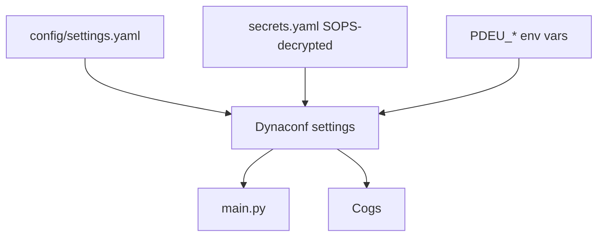

# pdeu-discord-bot

A Discord bot for the PlayDateEU gaming community. It watches one configured channel and reacts to messages: it quips back at `nice` (and one specific AI-overlord invocation), and converts mentioned currency amounts into every supported currency on the fly.

## Features

- Watches a single configurable channel.
- **NiceCog**: replies with a random community one-liner when Patropolis says `nice` (or `nice.` / `nice!`), and answers "I for one welcome our AI overlords." with "you will be killed last".
- **CurrencyCog**: when a message mentions `<amount> <code>` pairs in SEK, DKK, CZK, GBP, AUD, or EUR, replies with each amount converted to all other supported currencies, using [Frankfurter](https://frankfurter.dev) exchange rates with a 24-hour on-disc cache.
- Ignores all bot messages (including its own) to prevent feedback loops.
- Modular **cog-based architecture**: each feature is a self-contained file under `cogs/`. Add a new feature by dropping in a new cog — no edits to existing code.
- **Dynaconf + SOPS + age** configuration: non-secret config is version-controlled in YAML, secrets are encrypted at rest with [age](https://github.com/FiloSottile/age) via [SOPS](https://github.com/getsops/sops).
- Containerized via `Containerfile`, with CI and automated releases (release-please) publishing images to GHCR.

## Architecture

The bot uses `discord.py`'s `commands.Bot` and the **cog** pattern. `PDEUBot` (in `bot.py`) is a thin `commands.Bot` subclass that carries the watched channel ID so cogs can read it in their `setup()`. Each feature is a class that extends `MessageWatcherCog`, which centralizes the shared guards (ignore bots, channel filter). Feature cogs only implement `handle(message)`.

```
pdeu-discord-bot/
├── main.py          # Entry point: creates Bot, loads cogs, runs
├── bot.py           # PDEUBot — commands.Bot subclass carrying shared config
├── log_setup.py     # Logging config (stdout)
├── config/          # Dynaconf settings + SOPS loader for secrets.yaml
└── cogs/            # One module per feature
    ├── base.py      # MessageWatcherCog — shared guards (bots, channel)
    ├── nice.py      # "nice" quips + AI-overlord gag
    ├── currency.py  # Currency conversion (Frankfurter API + disc cache)
    └── example.py   # Template for new feature cogs
```

### Configuration loading order

Sources are merged in increasing precedence — later wins:

1. `config/settings.yaml` — non-secret defaults, per-environment sections.
2. `secrets.yaml` — SOPS+age encrypted secrets, decrypted at load time by `config/sops_loader.py`.
3. `PDEU_*` environment variables — for local overrides / CI / deploys where re-encrypting isn't worth it.

The active environment is selected with `ENV_FOR_DYNACONF` (default `development`); the matching `[<env>]` section in `config/settings.yaml` is applied on top of `[default]`.



## Prerequisites

- Python 3.14+
- [uv](https://github.com/astral-sh/uv) (or any modern Python toolchain)
- [age](https://github.com/FiloSottile/age#installation) — for key generation and as the SOPS backend
- [sops](https://github.com/getsops/sops#download) — for encrypting/decrypting `secrets.yaml`
- [Podman](https://podman.io) — optional, for the containerized `make build` / `make run` targets
- A Discord application with a bot user (create one at <https://discord.com/developers/applications>).

## Discord Setup

1. **Create an application** at <https://discord.com/developers/applications> and add a Bot user.
2. **Copy the bot token** from the Bot page — you'll put it in `secrets.yaml` during configuration below.
3. **Enable the Message Content Intent**: Bot → Privileged Gateway Intents → toggle on *Message Content Intent*. This is required for the bot to read message text.
4. **Invite the bot** to your server: OAuth2 → URL Generator → select scopes `bot` and `applications.commands`, and permissions `Send Messages` + `Read Message History`. Open the generated URL and authorize.
5. **Get the channel ID**: enable Developer Mode in Discord (Settings → Advanced → Developer Mode), right-click the target channel → Copy ID.

## Configuration

This project uses [Dynaconf](https://www.dynaconf.com/) for configuration and [SOPS](https://github.com/getsops/sops) + [age](https://github.com/FiloSottile/age) for secrets management. Non-secret config lives in `config/settings.yaml` (version-controlled); secrets live in `secrets.yaml` (SOPS-encrypted, **gitignored** — created during the setup below; only the `secrets.example.yaml` template is committed).

### One-time setup

#### 1. Install age and sops

- **age**: <https://github.com/FiloSottile/age#installation>
- **sops**: <https://github.com/getsops/sops#download>

Verify both are on your `PATH`:

```sh
age --version
sops --version
```

#### 2. Generate an age keypair

```sh
mkdir -p age
age-keygen -o age/keys.txt
```

`age/keys.txt` is gitignored — **never commit it**. The file looks like:

```
# created: 2026-07-07T12:00:00Z
# public key: age1qzv...your-public-key...
AGE-SECRET-KEY-1...
```

The `# public key:` line is what you share with sops; the `AGE-SECRET-KEY-1...` line is what decrypts your secrets. Back this file up somewhere safe — losing it means losing access to `secrets.yaml`.

#### 3. Register the public key with SOPS

Open `.sops.yaml` and replace the placeholder `age1xxx...` recipient with your real public key (the `age1...` string from `age/keys.txt`):

```yaml
creation_rules:
  - path_regex: ^secrets\.yaml$
    age: >-
      age1qzv...your-public-key...
```

If you're collaborating, list multiple recipients on one line, comma-separated — anyone whose public key is listed can decrypt (with their own private key).

#### 4. Create and encrypt your secrets file

```sh
cp secrets.example.yaml secrets.yaml
sops encrypt -i secrets.yaml
```

`-i` encrypts the file in place. Now edit the encrypted file — sops will transparently decrypt for editing and re-encrypt on save:

```sh
sops secrets.yaml
```

Set your real bot token:

```yaml
discord_token: your-real-bot-token
```

#### 5. Set the watched channel

Edit `config/settings.yaml` and set `watch_channel_id` under `default` (or under a specific environment like `development`):

```yaml
default:
  watch_channel_id: 123456789012345678
```

This is non-secret, so it lives in the version-controlled YAML, not in `secrets.yaml`.

### Selecting an environment

The active environment is chosen with `ENV_FOR_DYNACONF` (default `development`). The matching `[<env>]` section in `config/settings.yaml` overrides `[default]`.

```sh
ENV_FOR_DYNACONF=production uv run python main.py
```

### Logging

The bot uses Python's standard `logging` library, configured to write to **stdout**. Four levels are available: `DEBUG`, `INFO`, `WARNING`, `ERROR`.

The effective level defaults to `INFO` (so `DEBUG` is hidden) and is read from `log_level` in `config/settings.yaml`:

```yaml
default:
  log_level: INFO   # set to DEBUG to reveal debug logs
```

Override it at runtime without editing config via the `PDEU_LOG_LEVEL` environment variable:

```sh
PDEU_LOG_LEVEL=DEBUG uv run python main.py
```

The `discord.py` logger is configured independently via `discord_log_level` (default `INFO`, override with `PDEU_DISCORD_LOG_LEVEL`), so enabling `DEBUG` for the bot doesn't flood output with gateway internals. Set `PDEU_DISCORD_LOG_LEVEL=DEBUG` to inspect discord.py logs. Each module obtains a logger with `logging.getLogger(__name__)`.

To enable DEBUG for both the bot and discord.py:

```sh
PDEU_LOG_LEVEL=DEBUG PDEU_DISCORD_LOG_LEVEL=DEBUG uv run python main.py
```

### Overriding values without re-encrypting

Any setting can be overridden with a `PDEU_*` environment variable — useful for CI or quick local tweaks:

```sh
PDEU_DISCORD_TOKEN=staging-token PDEU_WATCH_CHANNEL_ID=999 uv run python main.py
```

### Adding a new secret

```sh
sops secrets.yaml
```

Add a key (it will be upper-cased automatically when loaded — `api_key` becomes `API_KEY`):

```yaml
discord_token: ...
api_key: some-other-secret
```

Save and quit; sops re-encrypts. Read it in code with `settings.API_KEY`.

### Rotating keys / adding a collaborator

Add the new public key to `.sops.yaml`'s `age:` list, then re-encrypt the file so the new recipient can decrypt it:

```sh
sops updatekeys secrets.yaml
```

To rotate a compromised key: remove the old recipient from `.sops.yaml`, add a new one, `sops updatekeys secrets.yaml`, then `sops secrets.yaml` to re-encrypt with the new key only. (SOPS cannot revoke access from someone who already has a copy of the file + old private key — treat rotation as "re-encrypt with new keys and rotate the secrets themselves if the old key was exposed.")

## CI & Releases

### CI

Every push to `main` and every pull request runs the [CI workflow](.github/workflows/ci.yaml): `make lint` (ruff + mypy) and a Containerfile build check.

### Releases (automated)

Releases are fully automated with [release-please](https://github.com/googleapis/release-please), driven by [conventional commits](https://www.conventionalcommits.org/):

1. Merge PRs to `main` using conventional commit messages (`feat: ...`, `fix: ...`, etc.).
2. release-please maintains a **Release PR** that bumps `version` in `pyproject.toml` and the `VERSION` file, and updates `CHANGELOG.md`, based on those commits.
3. Merging the Release PR creates the git tag (`vX.Y.Z`) and the GitHub Release.
4. The [release-please workflow](.github/workflows/release-please.yaml) then runs its `build-and-push` job: it builds the container image, pushes it to GHCR as `ghcr.io/<owner>/pdeu-discord-bot:vX.Y.Z` and `:latest`, and appends the pull command + digest to the release notes.

Version numbering is automatic: `fix:` → patch, `feat:` → minor, `feat!:`/`BREAKING CHANGE:` → major.

### Pulling the image

The GHCR package is private (matching the repo), so authenticate first with a PAT that has `read:packages`:

```sh
echo "$GITHUB_TOKEN" | docker login ghcr.io -u <your-username> --password-stdin
docker pull ghcr.io/<owner>/pdeu-discord-bot:latest
```

**One-time step — link the package to the repo:** after the first image push, go to your GitHub profile → *Packages* → `pdeu-discord-bot` → *Package settings* → *Connect repository* → select `pdeu-discord-bot`. The image then appears in the repo sidebar and inherits the repo's access permissions.

## Running

### Locally

```sh
uv run python main.py
# or, in an active virtualenv:
python main.py
```

On startup the bot prints its username, the watched channel, and the loaded cogs. If `DISCORD_TOKEN` or `WATCH_CHANNEL_ID` is missing, it exits with a clear message pointing back here.

### In a container

```sh
# Build (only rebuilds when sources change) and run detached, DEBUG logging off:
PDEU_DISCORD_TOKEN=... PDEU_WATCH_CHANNEL_ID=... make run

# Same with DEBUG level logging:
PDEU_DISCORD_TOKEN=... PDEU_WATCH_CHANNEL_ID=... make run-debug
```

The image ships without `secrets.yaml` or SOPS (see `.containerignore`) — in containers every secret comes from `PDEU_*` environment variables injected at runtime. The `data/` directory (exchange rate cache) is a named volume (`pdeu-discord-bot-data`) so cached rates survive restarts.

## How the Cogs Trigger

Shared guards from `MessageWatcherCog` (`cogs/base.py`) run first for every cog: the bot only acts on messages in the channel specified by `WATCH_CHANNEL_ID`, and ignores every message whose author is a bot (itself included).

### NiceCog (`cogs/nice.py`)

- If **anyone** sends exactly `I for one welcome our AI overlords.` (case-sensitive, whole message), the bot replies: `Very well, you will be killed last, <author>!`
- If **Patropolis** (a hard-coded Discord user ID in the cog) sends exactly `nice`, `nice.`, or `nice!` (case-insensitive, whole message), the bot replies with a random line from a fixed list of community one-liners.

Matching is whole-message equality, not substring matching — `that was nice` does **not** trigger.

To extend, add phrases to `NICE_LIST` in `cogs/nice.py`:

```python
NICE_LIST = ["nice", "nice.", "nice!", "noice"]
```

### CurrencyCog (`cogs/currency.py`)

- Scans the message for word pairs of the form `<amount> <CODE>` where `CODE` is one of `SEK`, `DKK`, `CZK`, `GBP`, `AUD`, `EUR` (case-insensitive), in order of appearance.
- Up to 5 pairs per message; the amount must be a non-negative number below 100,000,000. Anything else is silently skipped.
- Rates come from the [Frankfurter](https://frankfurter.dev) v2 API (EUR-based), cached on disc at `data/exchange_rates.json` for 24 hours. Writes are atomic, concurrent calls share a single network fetch, and a stale cache is served if a refresh fails (the next call retries).
- For each valid pair the bot replies with a code block converting the amount into every other supported currency, e.g.:

  ```
  100 SEK is: 8.75 EUR  76.06 DKK  190.1 CZK  6.43 GBP  13.42 AUD
  ```

  Conversions go through EUR; the original currency is omitted from the result.

## Adding a New Feature Cog

To add a new message-driven behavior:

1. **Copy `cogs/example.py`** to a new file, e.g. `cogs/reactions.py`.
2. **Rename the class** (e.g. `ReactionCog`) and implement `handle(message)` with your logic.
3. **Register it** by adding the module path to `INITIAL_COGS` in `main.py`:

   ```python
   INITIAL_COGS = [
       "cogs.nice",
       "cogs.currency",
       "cogs.reactions",  # new
   ]
   ```

No other changes needed. The shared guards (ignore bots, channel filter) are inherited from `MessageWatcherCog` automatically.

### Example: a new cog

```python
# cogs/reactions.py
import logging

import discord

from bot import PDEUBot

from .base import MessageWatcherCog

logger = logging.getLogger(__name__)


class ReactionCog(MessageWatcherCog):
    """Replies with a wave when someone says bye."""

    async def handle(self, message: discord.Message) -> None:
        if " bye " in f" {message.content} ":
            await message.channel.send("\U0001f44b")  # 👋


async def setup(bot: PDEUBot) -> None:
    await bot.add_cog(ReactionCog(bot, bot.watch_channel_id))
    logger.info("Loaded cog %s", __name__)
```
